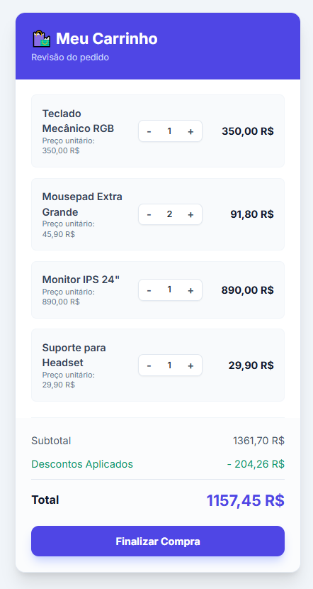

# 🛍️ Shopping Cart Challenge - Array.reduce()


Uma aplicação de carrinho de compras reativa desenvolvida com **Vanilla JavaScript** e estilizada com **Tailwind CSS**. 

O objetivo principal deste projeto foi explorar o poder do método `Array.reduce()` para cálculos financeiros e manipulação de estado no front-end, sem depender de frameworks pesados.

🔗 **[Acesse o Projeto Online Aqui](https://alicia-alexia.github.io/carrinho_compras/)**


---

## 🖼️ Preview



---

## 🚀 Funcionalidades

- ✅ **Cálculo Automático**: Uso de `reduce()` para somar subtotais e aplicar descontos.
- ✅ **Interatividade**: Aumentar e diminuir quantidade de itens com recálculo em tempo real.
- ✅ **Feedback Visual**: Estado de "loading" durante a finalização do pedido.
- ✅ **Formatação Monetária**: Uso da API nativa `Intl.NumberFormat` para moeda BRL (R$).

---

## 🛠️ Tecnologias Utilizadas

* **HTML5**
* **CSS3 / Tailwind CSS (via CDN)**
* **JavaScript (ES6+)**
    * `Array.reduce()`
    * DOM Manipulation
    * Event Listeners

---

## 🧠 Destaque Técnico (Code Snippet)

A lógica central do carrinho reside na função `calculateTotals`, onde encadeamos a lógica para obter os valores finais de forma limpa e funcional:

```javascript
function calculateTotals(items, discounts) {
    // 1. Calcula o Subtotal acumulando (preço * quantidade)
    const subtotal = items.reduce((acc, item) => {
        return acc + (item.price * item.quantity);
    }, 0);

    // 2. Calcula o valor monetário dos descontos
    const discountAmount = discounts.reduce((acc, discountRate) => {
        return acc + (subtotal * discountRate);
    }, 0);

    return { 
        subtotal, 
        discountAmount, 
        total: subtotal - discountAmount 
    };
}
```

## 🚀 Como executar

Basta clonar o repositório e abrir o arquivo `index.html` no seu navegador.

```bash
# Clone este repositório
$ git clone git remote add origin https://github.com/Alicia-Alexia/carrinho_compras.git

# Acesse a pasta do projeto no terminal/cmd
$ cd resumo_pedido
# Abra o index.html no navegador
```

## 📂 Estrutura de Arquivos

A estrutura foi pensada para projetos estáticos, mantendo a raiz limpa e os recursos organizados:

/resumo_pedido

    │
    ├── assets/              <-- Pasta principal de recursos
    │   ├── js/              <-- Pasta específica para Scripts
    │   │   └── script.js
    │   │
    │   │
    │   └── img/ 
    |        └── image.png     
    │
    ├── index.html           
    └── README.md         <-- Documentação


## 🤝 Autor
Desenvolvido por Alicia como parte de estudos em Frontend Development.